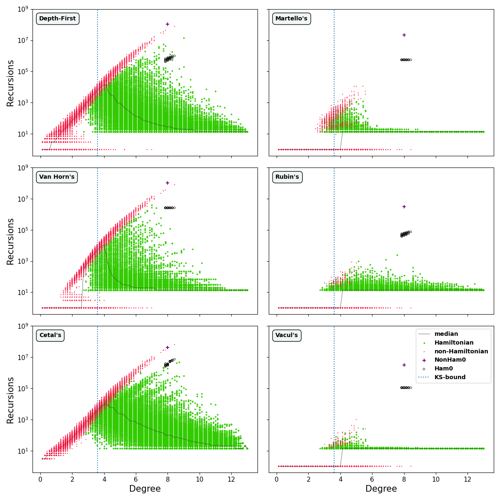
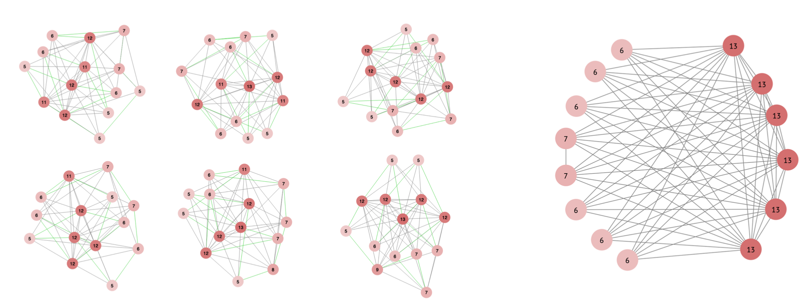

# Universally Hard Hamiltonian Cycle Problem Instances
This repository contains the source code and the data used for the paper "Universally Hard Hamiltonian Cycle Problem Instances"

## Dataset
The dataset of 91,000 random graphs of v=14 can be accessed at [indexed-14-node-test-set](indexed-14-node-test-set).

## Images
**Performance of 6 algorithms on the 91,000 graphs in the dataset, compared with the top instances evolved via a PPA algorithm.**

**The hardest non-hamiltonian instance on the right with the hardest hamiltonian instances on the left.**
